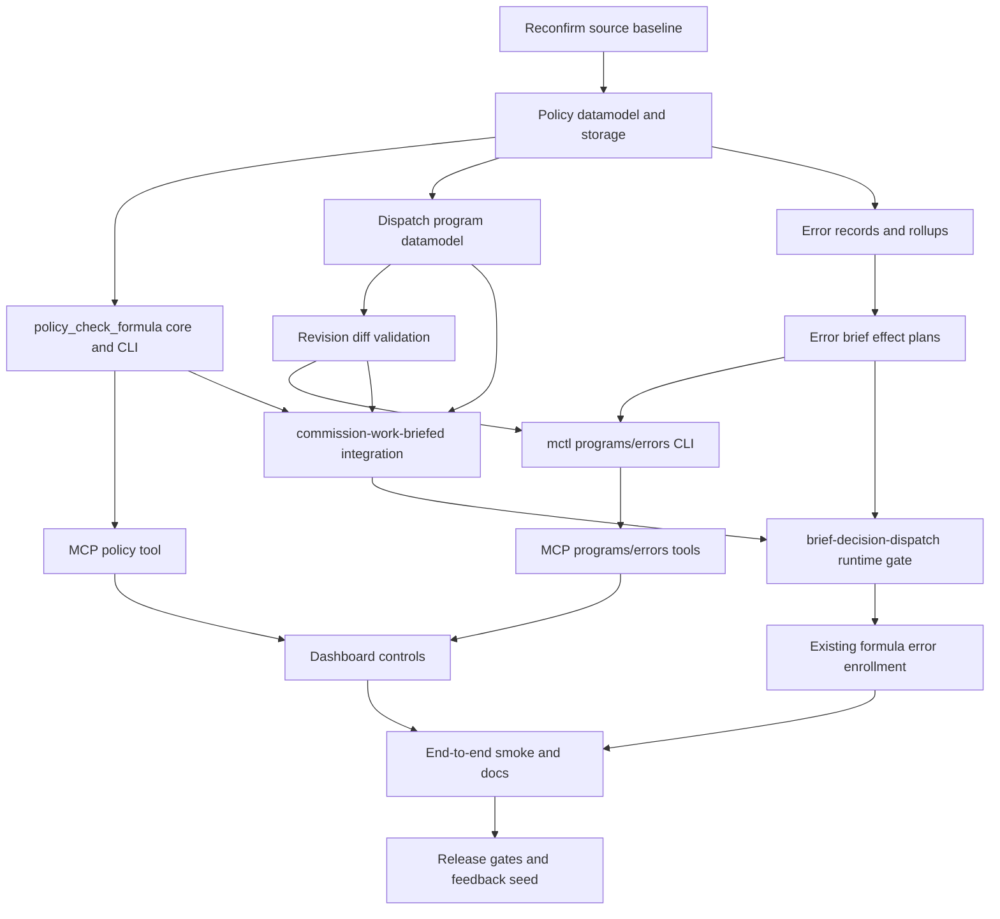

# Execution Policy and Error Briefs Implementation Plan

Parent: [Master Formula Rework Exploratory Handoff](./2026-08-24-master-formula-rework-exploratory-handoff.md)

> **For agentic workers:** REQUIRED SUB-SKILL: Use superpowers:subagent-driven-development (recommended) or superpowers:executing-plans to implement this plan task-by-task. Steps use checkbox (`- [ ]`) syntax for tracking.

**Goal:** Build typed support for commissioned dispatch programs, formula execution policy, error attribution, error briefs, and revision validation so `commission-work-briefed` can design composed work without pretending the current formula runtime is a general interpreter.

**Architecture:** `mctl_core` becomes the shared typed control layer for policies, generated programs, and error records; CLI, MCP, formulas, and dashboard all call that same Python core. `work-briefed` remains the proven router while `commission-work-briefed` gains stricter design-time validation and `brief-decision-dispatch` gains runtime gates before executing approved continuations.

**Tech Stack:** Python standard library dataclasses, JSON/JSONL, existing `mctl_core` CLI/MCP patterns, existing Gas City formula TOML, pytest, shell smoke tests, existing MathCity dashboard MCP transport.

---

## Global Constraints

- This document is a plan only. Do not execute implementation steps while saving or reviewing this file.
- Preserve the current source baseline: `work-briefed` is live-proven, `commission-work-briefed` is a design/approval path, and `brief-decision-dispatch` executes approved `commission-dispatch.v1` continuations.
- Do not claim formula TOML has runtime recursion today. The implementation must explicitly distinguish cook-time expansion, attach/sling composition, and future generated-program execution.
- Use `mctl_core` as the typed source of truth. CLI and MCP are adapters over the same functions, with no shell passthrough.
- The first public policy function is named `policy_check_formula`. Internally, model subjects generally so formulas, Python scripts, orders, generated programs, and skills can share policy machinery.
- Terminal/blocking errors produce error briefs. Warnings remain visible through `mctl`, dashboard, and events, but are lighter weight.
- Error briefs must include a recommendation and a typed effect plan. Approval executes that effect plan through `mctl`.
- Failed roots remain held until a resolution basis is accepted. An error brief does not by itself close the failed root.
- Repeated failures accumulate into rollups and feed correction of the actual cause: formula defect, composition error, input error, runtime infrastructure, policy gate, human revision needed, or unknown cause.
- Route-disable is human-approved except for narrow pre-approved no-brainer rules.
- Runtime policy wins over design approval when policy drifts after approval.
- Generated programs carry authoritative callable inventory. The design brief carries a projected copy for user review.
- Molecule/root close is not enough success evidence until the known closure issues are resolved.
- Use per-rig storage first because the default hold scope is the rig of dispatched work. City-wide views aggregate per-rig records.

## Source Facts To Preserve

- `mathcity/formulas/work-briefed.toml` classifies work into `COMMISSION`, `SIMPLE_CONTINUE`, `FULL_CONTINUE`, or `EXPLICIT_CONTINUE`, then slings the selected child formula.
- `mathcity/formulas/commission-work-briefed.toml` currently normalizes the source request, reconciles existing work, designs a dispatch graph, reviews it, and files an approval brief.
- `mathcity/formulas/brief-decision-dispatch.toml` currently validates and executes a single `commission-dispatch.v1` continuation with action `gc_sling`.
- Existing `mctl_core` modules use frozen dataclasses with `to_dict`, JSON schema descriptors in `schemas.py`, dry-run-first `EffectPlan` mutations in `effects.py`, trace rows under `.beads/mctl/traces`, and MCP schema validation before core functions run.
- The grilling record for this plan is saved at `mathcity/docs/superpowers/plans/2026-08-24-execution-policy-error-briefs-grilling-record.md`.

## First-Slice Decisions

These choices turn the grilling output into implementable work.

| Area | First-slice decision |
|---|---|
| Policy storage | Per rig under `<rig-root>/.beads/mctl/execution-policy/`. |
| Error storage | Per rig under `<rig-root>/.beads/mctl/errors/`. |
| Program storage | Per rig under `<rig-root>/.beads/mctl/programs/<program_id>/<version>.json`. |
| Subject model | General `PolicySubject`, with `kind = formula` used by `policy_check_formula`. |
| Command naming | CLI command `mctl policy_check_formula`; MCP tool `policy_check_formula`. |
| Dispatch program contract | New `dispatch-program.v1` artifact beside existing `commission-dispatch.v1` compatibility path. |
| Generated program reference | Store the full artifact and include `program_ref` plus digest in briefs. |
| Policy modes | `normal`, `degraded`, `brief_gated`, `manual_only`, `disabled`. |
| Error states | `observed`, `warning`, `filed`, `recovered`. |
| Failure classes | `compile_error`, `instantiation_error`, `runtime_error`, `semantic_error`. |
| Cause kinds | `formula_defect`, `composition_error`, `input_error`, `runtime_infra`, `policy_gate`, `human_revision_needed`, `unknown`. |
| Initial enrolled formulas | `work-briefed`, `commission-work-briefed`, `brief-decision-dispatch`, `brief-producer-failure-record`, `brief-producer-failure-rollup`, `brief-producer-repair`. |
| Dashboard scope | Read/list/check/apply typed policy and error actions through MCP only. |
| Direct `gc sling` enforcement | Not first slice. First slice gates MathCity wrappers and records core-enforcement gap. |

## File Structure

### New Python Core Files

- `mathcity/assets/scripts/mctl_core/policy.py`: policy subjects, policy records, exception records, digest helpers, matching rules, `policy_check_formula`, and policy storage readers.
- `mathcity/assets/scripts/mctl_core/errors.py`: formula/program error records, fingerprints, rollups, error storage readers/writers, and error-brief planning helpers.
- `mathcity/assets/scripts/mctl_core/programs.py`: `dispatch-program.v1` dataclasses, callable inventory validation, revision diffing, and material-change classification.

### Modified Python Core Files

- `mathcity/assets/scripts/mctl_core/cli.py`: add `policy_check_formula`, `errors`, and `programs` commands.
- `mathcity/assets/scripts/mctl_core/mcp_server.py`: add MCP tools that call the same policy, errors, and programs core functions.
- `mathcity/assets/scripts/mctl_core/schemas.py`: add JSON schema descriptors for execution policy, policy exceptions, policy check responses, formula error records, error rollups, dispatch programs, and program diffs.
- `mathcity/assets/scripts/mctl_core/effects.py`: add effect planning/application support for error brief creation, policy writes, error state updates, program artifact writes, and approved error actions.
- `mathcity/assets/scripts/mctl_core/work.py`: call `policy_check_formula` before dispatch paths that can execute a formula.
- `mathcity/assets/scripts/mctl_core/diagnostics.py`: add stable diagnostic codes for policy blocks, program validation failures, error brief self-exclusion, and unresolved failed roots.

### Modified Formula Files

- `mathcity/formulas/commission-work-briefed.toml`: require generated dispatch programs to include callable inventory, activation policy, finishing policy, revision policy, and design-time policy-check evidence.
- `mathcity/formulas/brief-decision-dispatch.toml`: runtime-check approved continuation/program policy before execution; file policy-blocked error brief when approval is stale.
- `mathcity/formulas/work-briefed.toml`: preserve live router behavior while adding optional policy evidence for explicit and commissioned routes.
- `mathcity/formulas/brief-producer-failure-record.toml`: enroll producer failure in normalized error records.
- `mathcity/formulas/brief-producer-failure-rollup.toml`: connect accumulated normalized errors to correction rollups.
- `mathcity/formulas/brief-producer-repair.toml`: consume rollup recommendations when the target cause is a producer defect.

### New Tests

- `mathcity/tests/mctl/test_execution_policy.py`
- `mathcity/tests/mctl/test_policy_check_formula_cli.py`
- `mathcity/tests/mctl/test_policy_check_formula_mcp.py`
- `mathcity/tests/mctl/test_formula_errors.py`
- `mathcity/tests/mctl/test_error_briefs.py`
- `mathcity/tests/mctl/test_dispatch_programs.py`
- `mathcity/tests/mctl/test_program_revision_diff.py`
- `mathcity/tests/commission-policy-integration/smoke_test.sh`
- `mathcity/tests/error-brief-conservation/smoke_test.sh`

### Modified Tests

- `mathcity/tests/mctl/test_mcp_schema_snapshots.py`: include new MCP tool schemas.
- `mathcity/tests/mctl/test_work_cli.py`: policy gate around formula dispatch.
- `mathcity/tests/mctl/test_commission_brief.py`: design brief contains program ref, callable inventory, finishing policy, and policy evidence.
- `mathcity/tests/mctl/test_commission_brief_tool.py`: MCP commission brief response carries the same evidence.
- `mathcity/tests/commission-work-briefed/smoke_test.sh`: commissioned design output validates as `dispatch-program.v1`.
- `mathcity/tests/brief-decision-dispatch/smoke_test.sh`: approval dispatch blocks on stale runtime policy.

### New Documentation

- `mathcity/subdomains/dev/docs/EXECUTION-POLICY-AND-ERROR-BRIEFS.md`: operator-facing design and command reference.
- `mathcity/subdomains/dev/docs/FORMULA-COMPOSITION-RUNTIME-BASELINE.md`: clear statement of current cook/attach/sling/runtime-loop behavior.

## PERT Network

Estimated effort is relative engineering time for an experienced MathCity worker. The critical path is the path with the most dependency pressure, not a calendar promise.

| ID | Work Product | Depends On | Estimate | Critical |
|---|---|---:|---:|---|
| P0 | Reconfirm source baseline and fixture strategy | none | 0.5 day | yes |
| P1 | Policy datamodel and storage | P0 | 1 day | yes |
| P2 | `policy_check_formula` core and CLI | P1 | 1 day | yes |
| P3 | MCP policy tool and schema snapshot | P2 | 0.5 day | yes |
| P4 | Dispatch program datamodel and callable inventory | P1 | 1 day | yes |
| P5 | Program diff and revision validation | P4 | 1 day | yes |
| P6 | Error datamodel, fingerprinting, and rollups | P1 | 1 day | yes |
| P7 | Error brief planning and approved effect actions | P6 | 1.5 days | yes |
| P8 | mctl error/program CLI surfaces | P5, P7 | 1 day | yes |
| P9 | MCP error/program tools | P8 | 0.5 day | no |
| P10 | `commission-work-briefed` design integration | P2, P4, P5 | 1 day | yes |
| P11 | `brief-decision-dispatch` runtime integration | P2, P7, P10 | 1 day | yes |
| P12 | Existing formula error enrollment | P6, P7, P11 | 1 day | yes |
| P13 | Dashboard controls through MCP | P3, P9 | 1 day | no |
| P14 | End-to-end smoke suite and docs | P10, P11, P12, P13 | 1.5 days | yes |
| P15 | Release gates and no-brainer feedback loop seed | P14 | 0.5 day | yes |

Critical path: `P0 -> P1 -> P2 -> P4 -> P5 -> P6 -> P7 -> P8 -> P10 -> P11 -> P12 -> P14 -> P15`.

Parallel lanes:

- `P3` can run after `P2` while `P4` is being built.
- `P6` can run after `P1` in parallel with `P4` and `P5` if interfaces are agreed.
- `P9` can run after `P8` while formula integration is in progress.
- `P13` can run after `P3` and `P9` while smoke tests mature.



## Interface Contracts

### `execution-policy.v1`

```json
{
  "contract": "execution-policy.v1",
  "policy_id": "policy-formula-commission-work-briefed-brief-gated",
  "subject": {
    "kind": "formula",
    "name": "commission-work-briefed",
    "hash": "sha256:<digest-or-empty-when-not-pinned>"
  },
  "mode": "brief_gated",
  "scope": {
    "city": "<city-root>",
    "rig": "mathcity"
  },
  "reason": "Generated dispatch programs require brief approval before execution.",
  "created_by": "mctl",
  "created_at": "2026-08-24T00:00:00Z",
  "expires": {
    "kind": "none"
  }
}
```

### `execution-policy-exception.v1`

```json
{
  "contract": "execution-policy-exception.v1",
  "exception_id": "ex-brief-approved-mc-1234",
  "policy_id": "policy-formula-commission-work-briefed-brief-gated",
  "subject": {
    "kind": "formula",
    "name": "commission-work-briefed",
    "hash": "sha256:<approved-subject-digest>"
  },
  "scope": {
    "city": "<city-root>",
    "rig": "mathcity",
    "source_bead": "mc-1234",
    "program_id": "dp-mc-1234"
  },
  "approved_by": "brief-decision-dispatch",
  "approved_at": "2026-08-24T00:00:00Z",
  "expires": {
    "kind": "when_repaired"
  }
}
```

### `dispatch-program.v1`

```json
{
  "contract": "dispatch-program.v1",
  "program_id": "dp-mc-1234",
  "version": 1,
  "source_bead": "mc-1234",
  "lineage": {
    "previous_program_id": null,
    "previous_version": null,
    "adjudication_ref": null
  },
  "activation_policy": {
    "mode": "brief_gated",
    "requires_brief": true
  },
  "finishing_policy": {
    "terminal_brief_required": true,
    "outputs": ["brief"]
  },
  "revision_policy": {
    "operator": "Revise(artifact_v0, adjudication) -> artifact_v1",
    "full_replacement_required": true,
    "diff_first_brief_required": true
  },
  "callable_inventory": [
    {
      "kind": "formula",
      "name": "simple-work-briefed",
      "hash": "sha256:<digest>",
      "dynamic": false
    }
  ],
  "graph": [
    {
      "call_id": "call-001",
      "parent_call_id": null,
      "subject": {"kind": "formula", "name": "simple-work-briefed"},
      "input_bead": "mc-1234",
      "vars": {}
    }
  ]
}
```

### `formula-error.v1`

```json
{
  "contract": "formula-error.v1",
  "error_id": "ferr-mc-1234-001",
  "state": "observed",
  "severity": "terminal",
  "failure_class": "runtime_error",
  "cause_kind": "unknown",
  "fingerprint": "sha256:<stable-fingerprint>",
  "root_bead": "mc-1234",
  "failed_bead": "mc-5678",
  "program_ref": "dp-mc-1234@1",
  "call": {
    "program_id": "dp-mc-1234",
    "program_version": 1,
    "call_id": "call-001",
    "parent_call_id": null,
    "caller_formula": "commission-work-briefed",
    "caller_step": "design-dispatch-plan",
    "callee": {"kind": "formula", "name": "simple-work-briefed", "hash": "sha256:<digest>"},
    "input_bead": "mc-1234",
    "runtime_vars": {},
    "output_root": "mc-5678"
  },
  "recommendation": {
    "action": "revise",
    "target": {"kind": "generated_program", "name": "dp-mc-1234"},
    "reason": "The generated graph called a formula blocked by current policy."
  },
  "resolution": null
}
```

## Tasks

### Task 1: Reconfirm Baseline And Fixtures

**Files:**
- Read: `mathcity/formulas/work-briefed.toml`
- Read: `mathcity/formulas/commission-work-briefed.toml`
- Read: `mathcity/formulas/brief-decision-dispatch.toml`
- Read: `mathcity/assets/scripts/mctl_core/cli.py`
- Read: `mathcity/assets/scripts/mctl_core/mcp_server.py`
- Read: `mathcity/assets/scripts/mctl_core/effects.py`
- Read: `mathcity/docs/superpowers/plans/2026-08-24-execution-policy-error-briefs-grilling-record.md`
- Create: `mathcity/subdomains/dev/docs/FORMULA-COMPOSITION-RUNTIME-BASELINE.md`

- [ ] **Step 1: Capture the source baseline in a doc**

Write `mathcity/subdomains/dev/docs/FORMULA-COMPOSITION-RUNTIME-BASELINE.md` with these sections:

```markdown
# Formula Composition Runtime Baseline

Date: 2026-08-24

## Current Runtime Facts

- `work-briefed` is the live-proven router and delegates to other formulas.
- `commission-work-briefed` designs and briefs dispatch, but does not execute generated work directly.
- `brief-decision-dispatch` executes approved `commission-dispatch.v1` continuations.
- Formula cook-time conditions include or exclude steps before execution.
- Bounded formula loops expand at cook time.
- `loop until` is recorded in cooked output but is not a current runtime recursion engine.
- `gc formula cook --attach` can append generated workflow, but attaching to the currently executing bead can block closure.
- `gc sling --on <formula>` is the proven execution path for formula work.

## Design Consequence

Generated dispatch programs must be represented as typed artifacts and executed
through explicit policy gates. They must not depend on implicit runtime recursion
that Gas City does not currently perform.
```

- [ ] **Step 2: Add fixture directory skeleton through tests, not hand-created empty dirs**

Create tests in later tasks that populate these directories under `tmp_path`:

```text
.beads/mctl/execution-policy/policies.jsonl
.beads/mctl/execution-policy/exceptions.jsonl
.beads/mctl/errors/errors.jsonl
.beads/mctl/errors/rollups.jsonl
.beads/mctl/programs/<program_id>/<version>.json
```

- [ ] **Step 3: Commit baseline doc**

```bash
git add mathcity/subdomains/dev/docs/FORMULA-COMPOSITION-RUNTIME-BASELINE.md
git commit -m "docs: record formula composition runtime baseline"
```

### Task 2: Add Execution Policy Datamodel

**Files:**
- Create: `mathcity/assets/scripts/mctl_core/policy.py`
- Test: `mathcity/tests/mctl/test_execution_policy.py`
- Modify: `mathcity/assets/scripts/mctl_core/schemas.py`

- [ ] **Step 1: Write datamodel tests**

Add this test skeleton and fill the helper imports from the module created in Step 3:

```python
from pathlib import Path

from mctl_core.policy import (
    ExecutionPolicy,
    ExecutionPolicyException,
    PolicySubject,
    matching_policy_result,
    read_policy_store,
    subject_digest,
)


def test_policy_subject_digest_reads_formula_source(tmp_path: Path):
    formula = tmp_path / "formulas" / "alpha.toml"
    formula.parent.mkdir(parents=True)
    formula.write_text('name = "alpha"\n', encoding="utf-8")

    assert subject_digest(formula).startswith("sha256:")


def test_most_restrictive_matching_policy_wins(tmp_path: Path):
    store = tmp_path / ".beads" / "mctl" / "execution-policy"
    store.mkdir(parents=True)
    (store / "policies.jsonl").write_text(
        '{"contract":"execution-policy.v1","policy_id":"p1","subject":{"kind":"formula","name":"alpha","hash":null},"mode":"degraded","scope":{"rig":"mathcity"},"reason":"soft risk","created_by":"test","created_at":"2026-08-24T00:00:00Z","expires":{"kind":"none"}}\n'
        '{"contract":"execution-policy.v1","policy_id":"p2","subject":{"kind":"formula","name":"alpha","hash":null},"mode":"manual_only","scope":{"rig":"mathcity"},"reason":"hard risk","created_by":"test","created_at":"2026-08-24T00:00:00Z","expires":{"kind":"none"}}\n',
        encoding="utf-8",
    )

    policies, exceptions = read_policy_store(tmp_path)
    result = matching_policy_result(
        subject=PolicySubject("formula", "alpha", None),
        policies=policies,
        exceptions=exceptions,
        scope={"rig": "mathcity"},
    )

    assert result.mode == "manual_only"
    assert result.blocked is True
    assert result.policy_id == "p2"
```

- [ ] **Step 2: Run tests to verify failure**

Run: `PYTHONPATH=mathcity/assets/scripts python -m pytest mathcity/tests/mctl/test_execution_policy.py -q`

Expected: FAIL because `mctl_core.policy` does not exist.

- [ ] **Step 3: Implement policy dataclasses and storage readers**

Create `mathcity/assets/scripts/mctl_core/policy.py` with:

```python
from __future__ import annotations

from dataclasses import dataclass
import hashlib
import json
from pathlib import Path
from typing import Mapping


POLICY_CONTRACT = "execution-policy.v1"
EXCEPTION_CONTRACT = "execution-policy-exception.v1"
POLICY_MODES = ("normal", "degraded", "brief_gated", "manual_only", "disabled")
MODE_RANK = {"normal": 0, "degraded": 1, "brief_gated": 2, "manual_only": 3, "disabled": 4}


@dataclass(frozen=True)
class PolicySubject:
    kind: str
    name: str
    hash: str | None = None

    def to_dict(self) -> dict[str, object]:
        return {"kind": self.kind, "name": self.name, "hash": self.hash}


@dataclass(frozen=True)
class ExecutionPolicy:
    policy_id: str
    subject: PolicySubject
    mode: str
    scope: Mapping[str, object]
    reason: str
    created_by: str
    created_at: str
    expires: Mapping[str, object]

    @classmethod
    def from_dict(cls, row: Mapping[str, object]) -> "ExecutionPolicy":
        subject = row["subject"]
        if not isinstance(subject, Mapping):
            raise ValueError("policy subject must be an object")
        return cls(
            policy_id=str(row["policy_id"]),
            subject=PolicySubject(str(subject["kind"]), str(subject["name"]), subject.get("hash")),
            mode=str(row["mode"]),
            scope=row.get("scope", {}),
            reason=str(row["reason"]),
            created_by=str(row["created_by"]),
            created_at=str(row["created_at"]),
            expires=row.get("expires", {"kind": "none"}),
        )

    def to_dict(self) -> dict[str, object]:
        return {
            "contract": POLICY_CONTRACT,
            "policy_id": self.policy_id,
            "subject": self.subject.to_dict(),
            "mode": self.mode,
            "scope": dict(self.scope),
            "reason": self.reason,
            "created_by": self.created_by,
            "created_at": self.created_at,
            "expires": dict(self.expires),
        }


@dataclass(frozen=True)
class ExecutionPolicyException:
    exception_id: str
    policy_id: str
    subject: PolicySubject
    scope: Mapping[str, object]
    approved_by: str
    approved_at: str
    expires: Mapping[str, object]

    @classmethod
    def from_dict(cls, row: Mapping[str, object]) -> "ExecutionPolicyException":
        subject = row["subject"]
        if not isinstance(subject, Mapping):
            raise ValueError("exception subject must be an object")
        return cls(
            exception_id=str(row["exception_id"]),
            policy_id=str(row["policy_id"]),
            subject=PolicySubject(str(subject["kind"]), str(subject["name"]), subject.get("hash")),
            scope=row.get("scope", {}),
            approved_by=str(row["approved_by"]),
            approved_at=str(row["approved_at"]),
            expires=row.get("expires", {"kind": "none"}),
        )


@dataclass(frozen=True)
class PolicyCheckResult:
    subject: PolicySubject
    mode: str
    blocked: bool
    policy_id: str | None
    exception_id: str | None
    reason: str

    def to_dict(self) -> dict[str, object]:
        return {
            "subject": self.subject.to_dict(),
            "mode": self.mode,
            "blocked": self.blocked,
            "policy_id": self.policy_id,
            "exception_id": self.exception_id,
            "reason": self.reason,
        }


def subject_digest(path: Path) -> str:
    return "sha256:" + hashlib.sha256(path.read_bytes()).hexdigest()


def policy_store_dir(rig_root: Path) -> Path:
    return rig_root / ".beads" / "mctl" / "execution-policy"


def read_policy_store(rig_root: Path) -> tuple[tuple[ExecutionPolicy, ...], tuple[ExecutionPolicyException, ...]]:
    root = policy_store_dir(rig_root)
    policies = tuple(ExecutionPolicy.from_dict(row) for row in _read_jsonl(root / "policies.jsonl", POLICY_CONTRACT))
    exceptions = tuple(ExecutionPolicyException.from_dict(row) for row in _read_jsonl(root / "exceptions.jsonl", EXCEPTION_CONTRACT))
    return policies, exceptions


def matching_policy_result(
    *,
    subject: PolicySubject,
    policies: tuple[ExecutionPolicy, ...],
    exceptions: tuple[ExecutionPolicyException, ...],
    scope: Mapping[str, object],
) -> PolicyCheckResult:
    matches = [policy for policy in policies if _subject_matches(policy.subject, subject) and _scope_matches(policy.scope, scope)]
    if not matches:
        return PolicyCheckResult(subject, "normal", False, None, None, "no matching policy")
    winner = max(matches, key=lambda policy: MODE_RANK[policy.mode])
    exception = next((item for item in exceptions if item.policy_id == winner.policy_id and _subject_matches(item.subject, subject) and _scope_matches(item.scope, scope)), None)
    blocked = winner.mode in {"brief_gated", "manual_only", "disabled"} and exception is None
    return PolicyCheckResult(subject, winner.mode, blocked, winner.policy_id, exception.exception_id if exception else None, winner.reason)


def _read_jsonl(path: Path, contract: str) -> list[Mapping[str, object]]:
    if not path.is_file():
        return []
    rows = []
    for line in path.read_text(encoding="utf-8").splitlines():
        if not line.strip():
            continue
        row = json.loads(line)
        if row.get("contract") == contract:
            rows.append(row)
    return rows


def _subject_matches(policy_subject: PolicySubject, actual: PolicySubject) -> bool:
    return (
        policy_subject.kind == actual.kind
        and policy_subject.name == actual.name
        and (policy_subject.hash is None or policy_subject.hash == actual.hash)
    )


def _scope_matches(policy_scope: Mapping[str, object], actual_scope: Mapping[str, object]) -> bool:
    for key, value in policy_scope.items():
        if key in actual_scope and actual_scope[key] != value:
            return False
    return True
```

- [ ] **Step 4: Add schema descriptors**

Add `EXECUTION_POLICY_SCHEMA`, `EXECUTION_POLICY_EXCEPTION_SCHEMA`, and `POLICY_CHECK_RESULT_SCHEMA` to `mathcity/assets/scripts/mctl_core/schemas.py` using the existing plain-dict schema style.

- [ ] **Step 5: Run tests to verify pass**

Run: `PYTHONPATH=mathcity/assets/scripts python -m pytest mathcity/tests/mctl/test_execution_policy.py -q`

Expected: PASS.

- [ ] **Step 6: Commit**

```bash
git add mathcity/assets/scripts/mctl_core/policy.py mathcity/assets/scripts/mctl_core/schemas.py mathcity/tests/mctl/test_execution_policy.py
git commit -m "feat: add execution policy model"
```

### Task 3: Add `policy_check_formula` CLI

**Files:**
- Modify: `mathcity/assets/scripts/mctl_core/policy.py`
- Modify: `mathcity/assets/scripts/mctl_core/cli.py`
- Test: `mathcity/tests/mctl/test_policy_check_formula_cli.py`

- [ ] **Step 1: Write CLI tests**

```python
import json
from pathlib import Path

from mctl_core.cli import main


def write_city(root: Path):
    (root / "city.toml").write_text('[[rigs]]\nname = "mathcity"\npath = "mathcity"\ndolt_database = "mathcity"\n', encoding="utf-8")
    rig = root / "mathcity"
    (rig / ".beads" / "config.yaml").parent.mkdir(parents=True)
    (rig / ".beads" / "config.yaml").write_text("prefix: mc\n", encoding="utf-8")
    source = root / "mathcity-source"
    (source / "formulas").mkdir(parents=True)
    (source / "formulas" / "alpha.toml").write_text('name = "alpha"\n', encoding="utf-8")
    (source / "assets" / "brief-pipeline").mkdir(parents=True)
    (source / "assets" / "brief-pipeline" / "paths.toml").write_text("", encoding="utf-8")
    (source / "assets" / "brief-pipeline" / "gates.toml").write_text("", encoding="utf-8")
    return rig, source


def test_policy_check_formula_reports_blocked_policy(tmp_path, capsys, monkeypatch):
    rig, source = write_city(tmp_path)
    monkeypatch.setenv("MCTL_SOURCE_CHECKOUT", str(source))
    policy_dir = rig / ".beads" / "mctl" / "execution-policy"
    policy_dir.mkdir(parents=True)
    (policy_dir / "policies.jsonl").write_text(
        '{"contract":"execution-policy.v1","policy_id":"p-alpha","subject":{"kind":"formula","name":"alpha","hash":null},"mode":"brief_gated","scope":{"rig":"mathcity"},"reason":"requires brief","created_by":"test","created_at":"2026-08-24T00:00:00Z","expires":{"kind":"none"}}\n',
        encoding="utf-8",
    )

    exit_code = main(["--city", str(tmp_path), "--rig", "mathcity", "policy_check_formula", "alpha", "--json"])

    assert exit_code == 2
    payload = json.loads(capsys.readouterr().out)
    assert payload["blocked"] is True
    assert payload["mode"] == "brief_gated"
    assert payload["policy_id"] == "p-alpha"
```

- [ ] **Step 2: Run CLI test to verify failure**

Run: `PYTHONPATH=mathcity/assets/scripts python -m pytest mathcity/tests/mctl/test_policy_check_formula_cli.py -q`

Expected: FAIL because the parser does not know `policy_check_formula`.

- [ ] **Step 3: Implement formula policy check function**

Add to `policy.py`:

```python
def policy_check_formula(ctx, formula_name: str, *, phase: str = "runtime") -> PolicyCheckResult:
    formula_path = ctx.source_checkout / "formulas" / f"{formula_name}.toml"
    digest = subject_digest(formula_path) if formula_path.is_file() else None
    policies, exceptions = read_policy_store(ctx.rig_root)
    return matching_policy_result(
        subject=PolicySubject("formula", formula_name, digest),
        policies=policies,
        exceptions=exceptions,
        scope={"city": str(ctx.city_root), "rig": ctx.rig_id, "phase": phase},
    )
```

- [ ] **Step 4: Add CLI parser and renderer**

Modify `cli.py`:

```python
from .policy import policy_check_formula
```

Add a top-level parser:

```python
policy_check = subparsers.add_parser("policy_check_formula")
policy_check.add_argument("formula")
policy_check.add_argument("--phase", choices=("design", "runtime"), default="runtime")
policy_check.add_argument("--json", action="store_true")
```

Route it in `main` before default work command:

```python
if args.command == "policy_check_formula":
    return _policy_check_formula_command(args, context)
```

Add:

```python
def _policy_check_formula_command(args: argparse.Namespace, context: MctlContext) -> int:
    result = policy_check_formula(context, args.formula, phase=args.phase)
    payload = result.to_dict()
    if args.json:
        print(json.dumps(payload, indent=2, sort_keys=True))
    else:
        status = "blocked" if result.blocked else "allowed"
        print(f"{args.formula}: {status} ({result.mode})")
        if result.reason:
            print(result.reason)
    return 2 if result.blocked else 0
```

- [ ] **Step 5: Run CLI tests**

Run: `PYTHONPATH=mathcity/assets/scripts python -m pytest mathcity/tests/mctl/test_policy_check_formula_cli.py mathcity/tests/mctl/test_execution_policy.py -q`

Expected: PASS.

- [ ] **Step 6: Commit**

```bash
git add mathcity/assets/scripts/mctl_core/policy.py mathcity/assets/scripts/mctl_core/cli.py mathcity/tests/mctl/test_policy_check_formula_cli.py
git commit -m "feat: expose policy_check_formula in mctl"
```

### Task 4: Add Policy MCP Tool

**Files:**
- Modify: `mathcity/assets/scripts/mctl_core/mcp_server.py`
- Modify: `mathcity/assets/scripts/mctl_core/schemas.py`
- Test: `mathcity/tests/mctl/test_policy_check_formula_mcp.py`
- Modify: `mathcity/tests/mctl/test_mcp_schema_snapshots.py`

- [ ] **Step 1: Write MCP tool test**

```python
from mctl_core.mcp_server import build_tools


def test_policy_check_formula_tool_is_typed():
    tools = build_tools(client_class="internal")
    tool = next(item for item in tools if item["name"] == "policy_check_formula")

    assert tool["inputSchema"]["required"] == ["formula"]
    assert tool["inputSchema"]["properties"]["phase"]["enum"] == ["design", "runtime"]
```

- [ ] **Step 2: Run test to verify failure**

Run: `PYTHONPATH=mathcity/assets/scripts python -m pytest mathcity/tests/mctl/test_policy_check_formula_mcp.py -q`

Expected: FAIL because no tool named `policy_check_formula` is registered.

- [ ] **Step 3: Add MCP request/response schemas**

Add to `schemas.py`:

```python
POLICY_CHECK_FORMULA_REQUEST_SCHEMA = request_schema(
    {
        "formula": {"type": "string"},
        "phase": {"type": "string", "enum": ["design", "runtime"], "default": "runtime"},
        "city": nullable_string("Runtime city root."),
        "rig": nullable_string("Rig id."),
    },
    required=["formula"],
)

POLICY_CHECK_FORMULA_RESPONSE_SCHEMA = response_schema(
    {
        "subject": {"type": "object"},
        "mode": {"type": "string", "enum": ["normal", "degraded", "brief_gated", "manual_only", "disabled"]},
        "blocked": {"type": "boolean"},
        "policy_id": nullable_string("Matching policy id."),
        "exception_id": nullable_string("Matching exception id."),
        "reason": {"type": "string"},
    }
)
```

- [ ] **Step 4: Register MCP tool**

In `mcp_server.py`, import `policy_check_formula` and add a handler matching existing tool registration style:

```python
ToolSpec(
    name="policy_check_formula",
    description="Check whether a formula is allowed under execution policy.",
    input_schema=POLICY_CHECK_FORMULA_REQUEST_SCHEMA,
    output_schema=POLICY_CHECK_FORMULA_RESPONSE_SCHEMA,
    handler=_policy_check_formula_tool,
)
```

Add:

```python
def _policy_check_formula_tool(args: Mapping[str, object], env: Mapping[str, str]) -> dict[str, object]:
    context = _resolve_tool_context(args, env)
    result = policy_check_formula(context, str(args["formula"]), phase=str(args.get("phase", "runtime")))
    return result.to_dict()
```

- [ ] **Step 5: Update schema snapshot**

Run: `PYTHONPATH=mathcity/assets/scripts python -m pytest mathcity/tests/mctl/test_mcp_schema_snapshots.py -q`

Expected: FAIL with snapshot mismatch naming `policy_check_formula`.

Update the snapshot fixture using the repository's existing snapshot update pattern from `test_mcp_schema_snapshots.py`.

- [ ] **Step 6: Run MCP tests**

Run: `PYTHONPATH=mathcity/assets/scripts python -m pytest mathcity/tests/mctl/test_policy_check_formula_mcp.py mathcity/tests/mctl/test_mcp_schema_snapshots.py -q`

Expected: PASS.

- [ ] **Step 7: Commit**

```bash
git add mathcity/assets/scripts/mctl_core/mcp_server.py mathcity/assets/scripts/mctl_core/schemas.py mathcity/tests/mctl/test_policy_check_formula_mcp.py mathcity/tests/mctl/test_mcp_schema_snapshots.py mathcity/tests/mctl/fixtures/mcp_tool_schemas.json
git commit -m "feat: expose policy_check_formula over MCP"
```

### Task 5: Add Dispatch Program Model And Callable Inventory

**Files:**
- Create: `mathcity/assets/scripts/mctl_core/programs.py`
- Modify: `mathcity/assets/scripts/mctl_core/schemas.py`
- Test: `mathcity/tests/mctl/test_dispatch_programs.py`

- [ ] **Step 1: Write validation tests**

```python
from mctl_core.programs import DispatchProgram, ProgramValidationError, validate_dispatch_program


def valid_program():
    return {
        "contract": "dispatch-program.v1",
        "program_id": "dp-mc-1234",
        "version": 1,
        "source_bead": "mc-1234",
        "lineage": {"previous_program_id": None, "previous_version": None, "adjudication_ref": None},
        "activation_policy": {"mode": "brief_gated", "requires_brief": True},
        "finishing_policy": {"terminal_brief_required": True, "outputs": ["brief"]},
        "revision_policy": {
            "operator": "Revise(artifact_v0, adjudication) -> artifact_v1",
            "full_replacement_required": True,
            "diff_first_brief_required": True,
        },
        "callable_inventory": [{"kind": "formula", "name": "simple-work-briefed", "hash": "sha256:abc", "dynamic": False}],
        "graph": [{"call_id": "call-001", "parent_call_id": None, "subject": {"kind": "formula", "name": "simple-work-briefed"}, "input_bead": "mc-1234", "vars": {}}],
    }


def test_valid_program_round_trips():
    program = validate_dispatch_program(valid_program())
    assert isinstance(program, DispatchProgram)
    assert program.to_dict()["program_id"] == "dp-mc-1234"


def test_open_dynamic_callable_raises_activation_floor():
    payload = valid_program()
    payload["callable_inventory"] = [{"kind": "formula", "name": "*", "hash": None, "dynamic": True}]
    payload["activation_policy"] = {"mode": "normal", "requires_brief": False}

    try:
        validate_dispatch_program(payload)
    except ProgramValidationError as error:
        assert error.code == "MPROG_DYNAMIC_CALLABLE_REQUIRES_GATE"
    else:
        raise AssertionError("dynamic callable without gate was accepted")
```

- [ ] **Step 2: Run tests to verify failure**

Run: `PYTHONPATH=mathcity/assets/scripts python -m pytest mathcity/tests/mctl/test_dispatch_programs.py -q`

Expected: FAIL because `mctl_core.programs` does not exist.

- [ ] **Step 3: Implement dispatch program dataclasses**

Create `programs.py` with frozen dataclasses for `CallableRef`, `ProgramCall`, `DispatchProgram`, and `ProgramValidationError`. Implement `validate_dispatch_program(payload)` with these exact checks:

```python
REQUIRED_TOP_LEVEL = (
    "contract",
    "program_id",
    "version",
    "source_bead",
    "lineage",
    "activation_policy",
    "finishing_policy",
    "revision_policy",
    "callable_inventory",
    "graph",
)

MATERIAL_FIELDS = (
    "callable_inventory",
    "activation_policy",
    "finishing_policy",
    "revision_policy",
    "source_bead",
)
```

Validation rules:

```python
if payload.get("contract") != "dispatch-program.v1":
    raise ProgramValidationError("MPROG_BAD_CONTRACT", "dispatch program contract must be dispatch-program.v1")
for key in REQUIRED_TOP_LEVEL:
    if key not in payload:
        raise ProgramValidationError("MPROG_MISSING_FIELD", f"dispatch program is missing {key}")
if not payload["callable_inventory"]:
    raise ProgramValidationError("MPROG_EMPTY_INVENTORY", "dispatch program callable inventory is empty")
if any(item.get("dynamic") and item.get("name") == "*" for item in payload["callable_inventory"]):
    mode = payload["activation_policy"].get("mode")
    if mode not in {"brief_gated", "manual_only", "disabled"}:
        raise ProgramValidationError("MPROG_DYNAMIC_CALLABLE_REQUIRES_GATE", "open dynamic callable requires brief_gated or stricter activation")
if payload["finishing_policy"].get("terminal_brief_required") is not True:
    raise ProgramValidationError("MPROG_TERMINAL_BRIEF_REQUIRED", "first slice requires terminal brief")
```

- [ ] **Step 4: Add schema descriptor**

Add `DISPATCH_PROGRAM_SCHEMA` and `PROGRAM_VALIDATION_RESPONSE_SCHEMA` to `schemas.py`.

- [ ] **Step 5: Run tests**

Run: `PYTHONPATH=mathcity/assets/scripts python -m pytest mathcity/tests/mctl/test_dispatch_programs.py -q`

Expected: PASS.

- [ ] **Step 6: Commit**

```bash
git add mathcity/assets/scripts/mctl_core/programs.py mathcity/assets/scripts/mctl_core/schemas.py mathcity/tests/mctl/test_dispatch_programs.py
git commit -m "feat: add dispatch program model"
```

### Task 6: Add Program Diff And Revision Validation

**Files:**
- Modify: `mathcity/assets/scripts/mctl_core/programs.py`
- Test: `mathcity/tests/mctl/test_program_revision_diff.py`

- [ ] **Step 1: Write diff tests**

```python
from copy import deepcopy

from mctl_core.programs import diff_programs, validate_program_revision
from tests.mctl.test_dispatch_programs import valid_program


def test_callable_inventory_change_is_material():
    old = valid_program()
    new = deepcopy(old)
    new["version"] = 2
    new["lineage"] = {"previous_program_id": old["program_id"], "previous_version": 1, "adjudication_ref": "brief:mc-approve"}
    new["callable_inventory"].append({"kind": "formula", "name": "review", "hash": "sha256:def", "dynamic": False})

    diff = diff_programs(old, new)

    assert "callable_inventory" in diff.material_fields
    assert diff.requires_reapproval is True


def test_revision_requires_lineage_to_previous_version():
    old = valid_program()
    new = deepcopy(old)
    new["version"] = 2
    new["lineage"] = {"previous_program_id": None, "previous_version": None, "adjudication_ref": "brief:mc-approve"}

    report = validate_program_revision(old, new, adjudication_ref="brief:mc-approve")

    assert report.valid is False
    assert "MPROG_REVISION_LINEAGE_MISMATCH" in [item["code"] for item in report.diagnostics]
```

- [ ] **Step 2: Run tests to verify failure**

Run: `PYTHONPATH=mathcity/assets/scripts python -m pytest mathcity/tests/mctl/test_program_revision_diff.py -q`

Expected: FAIL because diff functions do not exist.

- [ ] **Step 3: Implement diff and revision validation**

Add:

```python
@dataclass(frozen=True)
class ProgramDiff:
    material_fields: tuple[str, ...]
    nonmaterial_fields: tuple[str, ...]
    requires_reapproval: bool

    def to_dict(self) -> dict[str, object]:
        return {
            "material_fields": list(self.material_fields),
            "nonmaterial_fields": list(self.nonmaterial_fields),
            "requires_reapproval": self.requires_reapproval,
        }
```

Implement:

```python
def diff_programs(old_payload: Mapping[str, object], new_payload: Mapping[str, object]) -> ProgramDiff:
    material = []
    nonmaterial = []
    for key in sorted(set(old_payload) | set(new_payload)):
        if old_payload.get(key) == new_payload.get(key):
            continue
        if key in MATERIAL_FIELDS:
            material.append(key)
        else:
            nonmaterial.append(key)
    return ProgramDiff(tuple(material), tuple(nonmaterial), bool(material))
```

Implement `validate_program_revision(old_payload, new_payload, adjudication_ref)` so it validates both programs, checks `new.version == old.version + 1`, checks lineage points back to `old.program_id` and `old.version`, and checks the new lineage adjudication ref equals the supplied adjudication ref.

- [ ] **Step 4: Run tests**

Run: `PYTHONPATH=mathcity/assets/scripts python -m pytest mathcity/tests/mctl/test_program_revision_diff.py mathcity/tests/mctl/test_dispatch_programs.py -q`

Expected: PASS.

- [ ] **Step 5: Commit**

```bash
git add mathcity/assets/scripts/mctl_core/programs.py mathcity/tests/mctl/test_program_revision_diff.py
git commit -m "feat: validate dispatch program revisions"
```

### Task 7: Add Error Records, Fingerprints, And Rollups

**Files:**
- Create: `mathcity/assets/scripts/mctl_core/errors.py`
- Modify: `mathcity/assets/scripts/mctl_core/schemas.py`
- Test: `mathcity/tests/mctl/test_formula_errors.py`

- [ ] **Step 1: Write error tests**

```python
from pathlib import Path

from mctl_core.errors import FormulaErrorRecord, fingerprint_error, read_error_store, rollup_errors


def sample_error(root="mc-1", failed="mc-2"):
    return {
        "contract": "formula-error.v1",
        "error_id": f"ferr-{root}",
        "state": "observed",
        "severity": "terminal",
        "failure_class": "runtime_error",
        "cause_kind": "unknown",
        "fingerprint": "sha256:fixed",
        "root_bead": root,
        "failed_bead": failed,
        "program_ref": "dp-mc-1@1",
        "call": {"program_id": "dp-mc-1", "program_version": 1, "call_id": "call-001", "parent_call_id": None, "caller_formula": "commission-work-briefed", "caller_step": "design-dispatch-plan", "callee": {"kind": "formula", "name": "simple-work-briefed", "hash": "sha256:abc"}, "input_bead": root, "runtime_vars": {}, "output_root": failed},
        "recommendation": {"action": "revise", "target": {"kind": "generated_program", "name": "dp-mc-1"}, "reason": "policy blocked"},
        "resolution": None,
    }


def test_fingerprint_ignores_retry_specific_ids():
    one = sample_error(root="mc-a", failed="mc-b")
    two = sample_error(root="mc-c", failed="mc-d")
    one["fingerprint"] = fingerprint_error(one)
    two["fingerprint"] = fingerprint_error(two)

    assert one["fingerprint"] == two["fingerprint"]


def test_rollup_counts_distinct_roots_not_retry_attempts():
    records = [FormulaErrorRecord.from_dict(sample_error("mc-1", "mc-2")), FormulaErrorRecord.from_dict(sample_error("mc-1", "mc-3")), FormulaErrorRecord.from_dict(sample_error("mc-9", "mc-10"))]

    rollups = rollup_errors(records)

    assert rollups[0].distinct_roots == 2
```

- [ ] **Step 2: Run tests to verify failure**

Run: `PYTHONPATH=mathcity/assets/scripts python -m pytest mathcity/tests/mctl/test_formula_errors.py -q`

Expected: FAIL because `mctl_core.errors` does not exist.

- [ ] **Step 3: Implement error datamodel**

Create `errors.py` with frozen dataclasses for `FormulaErrorRecord`, `ErrorRecommendation`, `ErrorRollup`, and functions:

```python
ERROR_STATES = ("observed", "warning", "filed", "recovered")
FAILURE_CLASSES = ("compile_error", "instantiation_error", "runtime_error", "semantic_error")
CAUSE_KINDS = ("formula_defect", "composition_error", "input_error", "runtime_infra", "policy_gate", "human_revision_needed", "unknown")


def error_store_dir(rig_root: Path) -> Path:
    return rig_root / ".beads" / "mctl" / "errors"
```

`fingerprint_error(payload)` must hash stable fields only:

```python
stable = {
    "failure_class": payload.get("failure_class"),
    "cause_kind": payload.get("cause_kind"),
    "caller_formula": payload.get("call", {}).get("caller_formula"),
    "caller_step": payload.get("call", {}).get("caller_step"),
    "callee": payload.get("call", {}).get("callee"),
    "recommendation_action": payload.get("recommendation", {}).get("action"),
}
```

`rollup_errors(records)` groups by fingerprint and counts unique `root_bead` values.

- [ ] **Step 4: Add schemas**

Add `FORMULA_ERROR_SCHEMA` and `FORMULA_ERROR_ROLLUP_SCHEMA` to `schemas.py`.

- [ ] **Step 5: Run tests**

Run: `PYTHONPATH=mathcity/assets/scripts python -m pytest mathcity/tests/mctl/test_formula_errors.py -q`

Expected: PASS.

- [ ] **Step 6: Commit**

```bash
git add mathcity/assets/scripts/mctl_core/errors.py mathcity/assets/scripts/mctl_core/schemas.py mathcity/tests/mctl/test_formula_errors.py
git commit -m "feat: add formula error records"
```

### Task 8: Add Error Brief Planning And Effect Actions

**Files:**
- Modify: `mathcity/assets/scripts/mctl_core/errors.py`
- Modify: `mathcity/assets/scripts/mctl_core/effects.py`
- Test: `mathcity/tests/mctl/test_error_briefs.py`

- [ ] **Step 1: Write error brief tests**

```python
from mctl_core.errors import FormulaErrorRecord, plan_error_brief
from tests.mctl.test_formula_errors import sample_error


def test_terminal_error_brief_has_recommendation_and_effect_plan(fake_context):
    record = FormulaErrorRecord.from_dict(sample_error())

    plan = plan_error_brief(fake_context, record)

    assert plan.dry_run is True
    assert any(effect["kind"] == "bead_create" for effect in plan.planned_effects)
    assert "Recommended action: revise" in plan.cache_updates[0].file_create.content


def test_error_brief_self_excludes_from_recursive_loop(fake_context):
    payload = sample_error()
    payload["call"]["callee"]["name"] = "error-brief-producer"
    record = FormulaErrorRecord.from_dict(payload)

    plan = plan_error_brief(fake_context, record)

    assert any(advisory.code == "MERR_ERROR_BRIEF_SELF_EXCLUDED" for advisory in plan.advisories)
```

- [ ] **Step 2: Run tests to verify failure**

Run: `PYTHONPATH=mathcity/assets/scripts python -m pytest mathcity/tests/mctl/test_error_briefs.py -q`

Expected: FAIL because `plan_error_brief` does not exist.

- [ ] **Step 3: Implement error brief planner**

Implement `plan_error_brief(ctx, record)` using existing `effects.plan_create_brief` conventions. The generated brief body must include:

```markdown
# Error Brief: <error_id>

State: <state>
Severity: <severity>
Failure class: <failure_class>
Cause kind: <cause_kind>
Root bead: <root_bead>
Failed bead: <failed_bead>
Program: <program_ref>

## Attribution

- Caller formula: <caller_formula>
- Caller step: <caller_step>
- Callee: <kind>:<name>
- Call id: <call_id>

## Recommendation

Recommended action: <action>
Target: <target kind>:<target name>
Reason: <reason>

## Effect Plan

The recommended action must be applied through `mctl` after approval.
```

Specific self-exclusion rule:

```python
if record.call.callee.name == "error-brief-producer" and record.cause_kind != "formula_defect":
    return plan_with_advisory("MERR_ERROR_BRIEF_SELF_EXCLUDED")
```

- [ ] **Step 4: Add effect action dispatcher**

In `effects.py`, add a typed action branch for approved error actions:

```python
ERROR_ACTIONS = ("repair", "retry", "revise", "waive", "reject_source", "defer", "file_issue", "escalate", "disable_route")
```

Each branch returns an `EffectPlan`. The first implementation may create follow-up beads/briefs for all actions except `waive`, which records a `recovered` state with basis and evidence in the error store.

- [ ] **Step 5: Run tests**

Run: `PYTHONPATH=mathcity/assets/scripts python -m pytest mathcity/tests/mctl/test_error_briefs.py mathcity/tests/mctl/test_formula_errors.py -q`

Expected: PASS.

- [ ] **Step 6: Commit**

```bash
git add mathcity/assets/scripts/mctl_core/errors.py mathcity/assets/scripts/mctl_core/effects.py mathcity/tests/mctl/test_error_briefs.py
git commit -m "feat: plan error briefs from formula errors"
```

### Task 9: Add mctl Error And Program CLI Surfaces

**Files:**
- Modify: `mathcity/assets/scripts/mctl_core/cli.py`
- Modify: `mathcity/assets/scripts/mctl_core/errors.py`
- Modify: `mathcity/assets/scripts/mctl_core/programs.py`
- Test: `mathcity/tests/mctl/test_formula_errors.py`
- Test: `mathcity/tests/mctl/test_dispatch_programs.py`

- [ ] **Step 1: Add CLI commands**

Add these command shapes:

```text
mctl errors list --state observed --json
mctl errors show <error_id> --json
mctl errors file-brief <error_id> --json
mctl errors rollups --json
mctl errors resolve <error_id> --basis replacement_succeeded --evidence <text> --json
mctl programs validate <program_json> --json
mctl programs inventory <program_json> --json
mctl programs diff <old_program_json> <new_program_json> --json
mctl programs validate-revision <old_program_json> <new_program_json> --adjudication-ref <ref> --json
```

- [ ] **Step 2: Add CLI tests for error list and program validation**

```python
import json

from mctl_core.cli import main


def test_errors_list_filters_state(fake_city, capsys):
    exit_code = main(["--city", str(fake_city.city_root), "--rig", "mathcity", "errors", "list", "--state", "observed", "--json"])
    assert exit_code == 0
    payload = json.loads(capsys.readouterr().out)
    assert all(item["state"] == "observed" for item in payload["errors"])


def test_programs_validate_reports_valid_program(fake_city, tmp_path, capsys):
    program = tmp_path / "program.json"
    program.write_text(fake_city.valid_program_json, encoding="utf-8")
    exit_code = main(["--city", str(fake_city.city_root), "--rig", "mathcity", "programs", "validate", str(program), "--json"])
    assert exit_code == 0
    payload = json.loads(capsys.readouterr().out)
    assert payload["valid"] is True
```

- [ ] **Step 3: Implement CLI routing**

Add `_errors_command(args, context)` and `_programs_command(args, context)` in `cli.py`, mirroring `_briefs_command` and `_work_command`. Use `json.dumps(..., indent=2, sort_keys=True)` for JSON outputs and concise human output for non-JSON.

- [ ] **Step 4: Run tests**

Run: `PYTHONPATH=mathcity/assets/scripts python -m pytest mathcity/tests/mctl/test_formula_errors.py mathcity/tests/mctl/test_dispatch_programs.py -q`

Expected: PASS.

- [ ] **Step 5: Commit**

```bash
git add mathcity/assets/scripts/mctl_core/cli.py mathcity/assets/scripts/mctl_core/errors.py mathcity/assets/scripts/mctl_core/programs.py mathcity/tests/mctl/test_formula_errors.py mathcity/tests/mctl/test_dispatch_programs.py
git commit -m "feat: add mctl error and program commands"
```

### Task 10: Add MCP Error And Program Tools

**Files:**
- Modify: `mathcity/assets/scripts/mctl_core/mcp_server.py`
- Modify: `mathcity/assets/scripts/mctl_core/schemas.py`
- Modify: `mathcity/tests/mctl/test_mcp_schema_snapshots.py`
- Test: `mathcity/tests/mctl/test_policy_check_formula_mcp.py`

- [ ] **Step 1: Add tool names**

Register these internal MCP tools:

```text
errors_list
errors_show
errors_file_brief
errors_rollups
errors_resolve
programs_validate
programs_inventory
programs_diff
programs_validate_revision
```

- [ ] **Step 2: Add typed request schemas**

Each mutating tool must default to `dry_run = true`. `errors_file_brief`, `errors_resolve`, and any policy-writing tool must return an `EffectPlan` when `dry_run` is true.

- [ ] **Step 3: Add MCP tests**

```python
from mctl_core.mcp_server import build_tools


def test_error_and_program_tools_are_internal_only():
    internal = {tool["name"] for tool in build_tools(client_class="internal")}
    external = {tool["name"] for tool in build_tools(client_class="external")}

    assert "errors_list" in internal
    assert "programs_validate" in internal
    assert "errors_file_brief" in internal
    assert "errors_file_brief" not in external
```

- [ ] **Step 4: Run tests and update schema snapshot**

Run: `PYTHONPATH=mathcity/assets/scripts python -m pytest mathcity/tests/mctl/test_policy_check_formula_mcp.py mathcity/tests/mctl/test_mcp_schema_snapshots.py -q`

Expected: FAIL until the snapshot includes the new tool schemas; then PASS after updating the fixture.

- [ ] **Step 5: Commit**

```bash
git add mathcity/assets/scripts/mctl_core/mcp_server.py mathcity/assets/scripts/mctl_core/schemas.py mathcity/tests/mctl/test_policy_check_formula_mcp.py mathcity/tests/mctl/test_mcp_schema_snapshots.py mathcity/tests/mctl/fixtures/mcp_tool_schemas.json
git commit -m "feat: expose errors and programs over MCP"
```

### Task 11: Integrate Design-Time Checks Into `commission-work-briefed`

**Files:**
- Modify: `mathcity/formulas/commission-work-briefed.toml`
- Test: `mathcity/tests/commission-work-briefed/smoke_test.sh`
- Modify: `mathcity/tests/mctl/test_commission_brief.py`
- Modify: `mathcity/tests/mctl/test_commission_brief_tool.py`

- [ ] **Step 1: Update smoke expectation**

Extend the smoke test so the produced brief must contain:

```text
contract = "dispatch-program.v1"
program_ref =
callable_inventory =
activation_policy =
finishing_policy =
revision_policy =
policy_check_formula
```

- [ ] **Step 2: Run smoke test to verify failure**

Run: `bash mathcity/tests/commission-work-briefed/smoke_test.sh`

Expected: FAIL because current commissioned briefs do not carry the new dispatch program fields.

- [ ] **Step 3: Update formula design instructions**

Modify `commission-work-briefed.toml` so `design-dispatch-plan` requires:

```toml
[dispatch_program]
contract = "dispatch-program.v1"
program_id = "<stable id derived from source bead>"
version = 1
source_bead = "{{source_bead}}"

[dispatch_program.activation_policy]
mode = "brief_gated"
requires_brief = true

[dispatch_program.finishing_policy]
terminal_brief_required = true
outputs = ["brief"]

[dispatch_program.revision_policy]
operator = "Revise(artifact_v0, adjudication) -> artifact_v1"
full_replacement_required = true
diff_first_brief_required = true
```

Require the worker prompt to run:

```bash
mctl policy_check_formula <formula-name> --phase design --json
mctl programs validate <dispatch-program-json> --json
```

- [ ] **Step 4: Add mctl commission tests**

Assert that commission brief payloads include the program ref and policy evidence in both CLI and MCP paths.

- [ ] **Step 5: Run tests**

Run: `PYTHONPATH=mathcity/assets/scripts python -m pytest mathcity/tests/mctl/test_commission_brief.py mathcity/tests/mctl/test_commission_brief_tool.py -q`

Expected: PASS.

Run: `bash mathcity/tests/commission-work-briefed/smoke_test.sh`

Expected: PASS.

- [ ] **Step 6: Commit**

```bash
git add mathcity/formulas/commission-work-briefed.toml mathcity/tests/commission-work-briefed/smoke_test.sh mathcity/tests/mctl/test_commission_brief.py mathcity/tests/mctl/test_commission_brief_tool.py
git commit -m "feat: validate commissioned dispatch programs"
```

### Task 12: Integrate Runtime Policy Gate Into `brief-decision-dispatch`

**Files:**
- Modify: `mathcity/formulas/brief-decision-dispatch.toml`
- Modify: `mathcity/assets/scripts/mctl_core/errors.py`
- Test: `mathcity/tests/brief-decision-dispatch/smoke_test.sh`

- [ ] **Step 1: Add stale-policy smoke case**

Extend the smoke test with an approved continuation whose formula now has a runtime `manual_only` policy and no matching exception.

Expected result:

```text
dispatch blocked
error brief planned
source bead remains held
policy_check_formula mode manual_only
```

- [ ] **Step 2: Run smoke test to verify failure**

Run: `bash mathcity/tests/brief-decision-dispatch/smoke_test.sh`

Expected: FAIL because current dispatch does not runtime-check policy.

- [ ] **Step 3: Update dispatch formula**

Before the `gc sling` action, require:

```bash
mctl policy_check_formula "$cont_formula" --phase runtime --json
```

If blocked, require:

```bash
mctl errors file-brief "$error_id" --json
```

Do not run `gc sling` when runtime policy blocks. Record the error as `failure_class = "runtime_error"` and `cause_kind = "policy_gate"`.

- [ ] **Step 4: Run smoke test**

Run: `bash mathcity/tests/brief-decision-dispatch/smoke_test.sh`

Expected: PASS.

- [ ] **Step 5: Commit**

```bash
git add mathcity/formulas/brief-decision-dispatch.toml mathcity/assets/scripts/mctl_core/errors.py mathcity/tests/brief-decision-dispatch/smoke_test.sh
git commit -m "feat: gate approved dispatch at runtime"
```

### Task 13: Enroll Existing Formula Errors

**Files:**
- Modify: `mathcity/formulas/work-briefed.toml`
- Modify: `mathcity/formulas/brief-producer-failure-record.toml`
- Modify: `mathcity/formulas/brief-producer-failure-rollup.toml`
- Modify: `mathcity/formulas/brief-producer-repair.toml`
- Test: `mathcity/tests/error-brief-conservation/smoke_test.sh`

- [ ] **Step 1: Write conservation smoke test**

Create a smoke test that simulates a terminal failure in one enrolled formula and asserts:

```text
formula-error.v1 record exists
error brief exists or is planned
root bead is held
rollup count increments by one distinct root
```

- [ ] **Step 2: Run smoke test to verify failure**

Run: `bash mathcity/tests/error-brief-conservation/smoke_test.sh`

Expected: FAIL because enrolled formulas do not yet emit normalized error records.

- [ ] **Step 3: Add generated `[[errors]]` sections**

Add a generated section to each enrolled formula with stable error declarations. Use this shape:

```toml
[[errors]]
code = "WORK_BRIEFED_DISPATCH_FAILED"
failure_class = "runtime_error"
default_cause_kind = "unknown"
terminal = true
brief_required = true
recommendation_actions = ["retry", "revise", "repair", "defer"]
```

Use formula-specific codes:

```text
WORK_BRIEFED_DISPATCH_FAILED
COMMISSION_PROGRAM_INVALID
COMMISSION_POLICY_BLOCKED
BRIEF_DECISION_RUNTIME_POLICY_BLOCKED
BRIEF_PRODUCER_FAILURE_RECORDED
BRIEF_PRODUCER_FAILURE_ROLLUP_READY
BRIEF_PRODUCER_REPAIR_FAILED
```

- [ ] **Step 4: Wire formula failure steps to `mctl errors`**

In each enrolled formula prompt, require workers to run the relevant `mctl errors` command when a declared terminal error occurs. Preserve existing producer-failure behavior and add normalized records beside it.

- [ ] **Step 5: Run smoke test**

Run: `bash mathcity/tests/error-brief-conservation/smoke_test.sh`

Expected: PASS.

- [ ] **Step 6: Commit**

```bash
git add mathcity/formulas/work-briefed.toml mathcity/formulas/brief-producer-failure-record.toml mathcity/formulas/brief-producer-failure-rollup.toml mathcity/formulas/brief-producer-repair.toml mathcity/tests/error-brief-conservation/smoke_test.sh
git commit -m "feat: enroll core formulas in error briefs"
```

### Task 14: Add Dashboard Controls Through MCP

**Files:**
- Modify: `mathcity/assets/scripts/mctl_dashboard/server.py`
- Modify: dashboard frontend files under `mathcity/assets/scripts/mctl_dashboard/`
- Test: `mathcity/tests/mctl/test_dashboard_tool_reachability.py`
- Test: `mathcity/tests/mctl/test_dashboard_mutation_safety.py`

- [ ] **Step 1: Add dashboard reachability tests**

```python
def test_dashboard_reads_errors_through_mcp(dashboard_client):
    response = dashboard_client.get("/api/errors?state=observed")
    assert response.status_code == 200
    assert response.json()["transport"] == "mcp"


def test_dashboard_policy_apply_is_dry_run_first(dashboard_client):
    response = dashboard_client.post("/api/policy/formula/alpha", json={"mode": "manual_only"})
    assert response.status_code == 200
    assert response.json()["effect_plan"]["dry_run"] is True
```

- [ ] **Step 2: Run tests to verify failure**

Run: `PYTHONPATH=mathcity/assets/scripts python -m pytest mathcity/tests/mctl/test_dashboard_tool_reachability.py mathcity/tests/mctl/test_dashboard_mutation_safety.py -q`

Expected: FAIL because dashboard endpoints do not yet call the new MCP tools.

- [ ] **Step 3: Add dashboard endpoints**

Add endpoints:

```text
GET /api/errors
GET /api/errors/<error_id>
POST /api/errors/<error_id>/file-brief
POST /api/errors/<error_id>/resolve
GET /api/programs/<program_id>
POST /api/programs/diff
POST /api/policy/formula/<formula_name>
```

All mutations call MCP with `dry_run = true` unless the user explicitly confirms apply in the existing dashboard mutation confirmation flow.

- [ ] **Step 4: Add minimal UI controls**

Add dashboard controls in the developer section:

```text
Formula policy status
Error records
Error rollups
Program diff
File error brief
Resolve error
```

Each control must display the mctl trace id returned by MCP.

- [ ] **Step 5: Run dashboard tests**

Run: `PYTHONPATH=mathcity/assets/scripts python -m pytest mathcity/tests/mctl/test_dashboard_tool_reachability.py mathcity/tests/mctl/test_dashboard_mutation_safety.py -q`

Expected: PASS.

- [ ] **Step 6: Commit**

```bash
git add mathcity/assets/scripts/mctl_dashboard mathcity/tests/mctl/test_dashboard_tool_reachability.py mathcity/tests/mctl/test_dashboard_mutation_safety.py
git commit -m "feat: add dashboard policy and error controls"
```

### Task 15: Integrate `mctl work` Dispatch Policy Gate

**Files:**
- Modify: `mathcity/assets/scripts/mctl_core/work.py`
- Modify: `mathcity/assets/scripts/mctl_core/cli.py`
- Test: `mathcity/tests/mctl/test_work_cli.py`
- Test: `mathcity/tests/mctl/test_work_route_to.py`

- [ ] **Step 1: Write work dispatch tests**

```python
def test_work_dispatch_blocks_disabled_formula(fake_context):
    plan = plan_dispatch(fake_context, source_bead="mc-1", formula="alpha")
    assert plan.blocked is True
    assert any(diag.code == "MPOL_FORMULA_DISABLED" for diag in plan.diagnostics)


def test_explicit_continue_reports_policy_evidence(fake_context):
    event = plan_dispatch_event(fake_context, source_bead="mc-1", formula="commission-work-briefed")
    assert event["policy_check"]["subject"]["name"] == "commission-work-briefed"
```

- [ ] **Step 2: Run tests to verify failure**

Run: `PYTHONPATH=mathcity/assets/scripts python -m pytest mathcity/tests/mctl/test_work_cli.py mathcity/tests/mctl/test_work_route_to.py -q`

Expected: FAIL because dispatch plans do not call `policy_check_formula`.

- [ ] **Step 3: Call policy gate from work planner**

Before returning an executable dispatch plan for a formula, call:

```python
result = policy_check_formula(context, formula, phase="runtime")
if result.blocked:
    return blocked_dispatch_plan(context, result)
```

Use diagnostic codes:

```text
MPOL_FORMULA_BRIEF_GATED
MPOL_FORMULA_MANUAL_ONLY
MPOL_FORMULA_DISABLED
```

- [ ] **Step 4: Run work tests**

Run: `PYTHONPATH=mathcity/assets/scripts python -m pytest mathcity/tests/mctl/test_work_cli.py mathcity/tests/mctl/test_work_route_to.py -q`

Expected: PASS.

- [ ] **Step 5: Commit**

```bash
git add mathcity/assets/scripts/mctl_core/work.py mathcity/assets/scripts/mctl_core/cli.py mathcity/tests/mctl/test_work_cli.py mathcity/tests/mctl/test_work_route_to.py
git commit -m "feat: gate mctl work dispatch by policy"
```

### Task 16: Write Operator Documentation

**Files:**
- Create: `mathcity/subdomains/dev/docs/EXECUTION-POLICY-AND-ERROR-BRIEFS.md`
- Modify: `mathcity/docs/FORMULAS-STATUS.md`

- [ ] **Step 1: Write command reference**

Create `EXECUTION-POLICY-AND-ERROR-BRIEFS.md` with these sections:

```markdown
# Execution Policy And Error Briefs

## Purpose

This system lets MathCity distinguish designed work, approved execution,
runtime policy drift, terminal errors, warnings, and resolution.

## Commands

- `mctl policy_check_formula <formula> --phase design --json`
- `mctl policy_check_formula <formula> --phase runtime --json`
- `mctl errors list --state observed --json`
- `mctl errors show <error_id> --json`
- `mctl errors file-brief <error_id> --json`
- `mctl errors resolve <error_id> --basis replacement_succeeded --evidence "<text>" --json`
- `mctl programs validate <program_json> --json`
- `mctl programs diff <old_program_json> <new_program_json> --json`
- `mctl programs validate-revision <old_program_json> <new_program_json> --adjudication-ref <ref> --json`

## Operator Rules

- Terminal/blocking errors file error briefs.
- Warnings are visible without forcing adjudication.
- Failed roots remain held until a resolution basis is accepted.
- Route-disable requires human approval except for narrow pre-approved no-brainer rules.
- Runtime policy wins over old approval.
- Dispatch programs are not arbitrary runtime recursion.
```

- [ ] **Step 2: Update formula status**

Update `FORMULAS-STATUS.md` to mark `commission-work-briefed` as design-gated by `dispatch-program.v1` after tests pass. Do not mark it live-proven unless an end-to-end live run proves it.

- [ ] **Step 3: Commit**

```bash
git add mathcity/subdomains/dev/docs/EXECUTION-POLICY-AND-ERROR-BRIEFS.md mathcity/docs/FORMULAS-STATUS.md
git commit -m "docs: document execution policy and error briefs"
```

### Task 17: End-To-End Smoke And Release Gate

**Files:**
- Create: `mathcity/tests/commission-policy-integration/smoke_test.sh`
- Modify: `mathcity/tests/test-runner/test_runner_names_failing_tests.sh`
- Modify: `mathcity/docs/superpowers/plans/2026-08-23-EXECUTION-PROGRESS.md`

- [ ] **Step 1: Write E2E smoke test**

The smoke test must perform this flow in a temp city:

```text
create source bead
run commissioned design
validate produced dispatch-program.v1
approve brief
runtime policy check passes
dispatch executes
terminal brief appears or is planned
```

And this failure flow:

```text
create source bead
run commissioned design
approve brief
change policy to manual_only for selected formula
brief-decision-dispatch blocks execution
formula-error.v1 record appears
error brief appears or is planned
source/root remains held
```

- [ ] **Step 2: Run E2E smoke test to verify failure**

Run: `bash mathcity/tests/commission-policy-integration/smoke_test.sh`

Expected: FAIL until Tasks 11 through 15 are complete.

- [ ] **Step 3: Add release gate to test runner**

Ensure the test runner names these failure suites explicitly:

```text
commission-policy-integration
error-brief-conservation
commission-work-briefed
brief-decision-dispatch
```

- [ ] **Step 4: Run targeted suite**

Run:

```bash
PYTHONPATH=mathcity/assets/scripts python -m pytest mathcity/tests/mctl/test_execution_policy.py mathcity/tests/mctl/test_policy_check_formula_cli.py mathcity/tests/mctl/test_policy_check_formula_mcp.py mathcity/tests/mctl/test_formula_errors.py mathcity/tests/mctl/test_error_briefs.py mathcity/tests/mctl/test_dispatch_programs.py mathcity/tests/mctl/test_program_revision_diff.py -q
bash mathcity/tests/commission-policy-integration/smoke_test.sh
bash mathcity/tests/error-brief-conservation/smoke_test.sh
```

Expected: all commands PASS.

- [ ] **Step 5: Update progress doc**

Record:

```markdown
## Execution Policy And Error Briefs

- `policy_check_formula` is available in mctl and MCP.
- `dispatch-program.v1` validates callable inventory and revision lineage.
- Terminal formula/program errors produce normalized records and error briefs.
- Runtime policy drift blocks approved dispatch and files a policy-gate error brief.
- Existing enrolled formulas emit normalized error declarations.
```

- [ ] **Step 6: Commit**

```bash
git add mathcity/tests/commission-policy-integration/smoke_test.sh mathcity/tests/test-runner/test_runner_names_failing_tests.sh mathcity/docs/superpowers/plans/2026-08-23-EXECUTION-PROGRESS.md
git commit -m "test: gate execution policy and error brief integration"
```

## Validation Matrix

| Requirement | Validation |
|---|---|
| `policy_check_formula` exists in CLI | `mathcity/tests/mctl/test_policy_check_formula_cli.py` |
| `policy_check_formula` exists in MCP | `mathcity/tests/mctl/test_policy_check_formula_mcp.py` |
| General policy model supports formula first | `mathcity/tests/mctl/test_execution_policy.py` |
| Most restrictive policy wins | `test_most_restrictive_matching_policy_wins` |
| Runtime policy wins over stale approval | `mathcity/tests/brief-decision-dispatch/smoke_test.sh` |
| Dispatch program has callable inventory | `mathcity/tests/mctl/test_dispatch_programs.py` |
| Open dynamic calls raise activation floor | `test_open_dynamic_callable_raises_activation_floor` |
| Revision is full replacement with lineage | `mathcity/tests/mctl/test_program_revision_diff.py` |
| Material diff includes callable inventory | `test_callable_inventory_change_is_material` |
| Errors visible without dashboard | `mctl errors list --state observed --json` test |
| Terminal errors produce error briefs | `mathcity/tests/mctl/test_error_briefs.py` |
| Error briefs recommend action | `test_terminal_error_brief_has_recommendation_and_effect_plan` |
| Error brief actions are typed effects | `mathcity/assets/scripts/mctl_core/effects.py` tests |
| Failed root remains held | `mathcity/tests/error-brief-conservation/smoke_test.sh` |
| Repeated failures roll up by root | `test_rollup_counts_distinct_roots_not_retry_attempts` |
| Dashboard does not bypass mctl | `mathcity/tests/mctl/test_dashboard_tool_reachability.py` |

## Rollout Order

1. Land policy datamodel and `policy_check_formula` without changing live routing.
2. Land dispatch-program validation without changing live routing.
3. Land error records and error-brief planning without forcing all formulas to emit them.
4. Gate commissioned design output in `commission-work-briefed`.
5. Gate approved execution in `brief-decision-dispatch`.
6. Enroll existing formulas in normalized error reporting.
7. Add dashboard controls after CLI and MCP are already validated.
8. Review live evidence before expanding default routing through commissioned programs.

## Risks And Controls

| Risk | Control |
|---|---|
| Generated graph calls a disabled formula | Design-time and runtime `policy_check_formula` both block. |
| Error brief producer creates a recursive failure loop | Self-exclusion advisory and specific producer-broken exception case. |
| Callable inventory lies or is incomplete | Program validation raises activation floor or blocks. |
| Approval becomes stale after policy changes | Runtime policy wins and files policy-gate error brief. |
| Existing formulas emit inconsistent errors | Generated `[[errors]]` section plus mctl normalization. |
| Molecule close remains unreliable | Finishing policy requires explicit evidence beyond root closure. |
| User cannot see errors without dashboard | `mctl errors list`, `show`, `rollups`, and `file-brief`. |
| Too many formulas are exposed as building blocks | Curated capability palette; prime formula list is input, not public API. |

## Self-Review Notes

- Spec coverage: the plan covers the original work-formula behavior question, prime/composite formula concern, design/activation/finishing split, revision operator, error attribution, error briefs, conservation, `mctl` wrapping, MCP tools, dashboard controls, and policy drift.
- Type consistency: policy uses `PolicySubject`; programs use callable refs with the same subject shape; errors carry call provenance and recommendation targets using the same kind/name pattern.
- Execution status: no implementation steps have been executed by writing this document.
