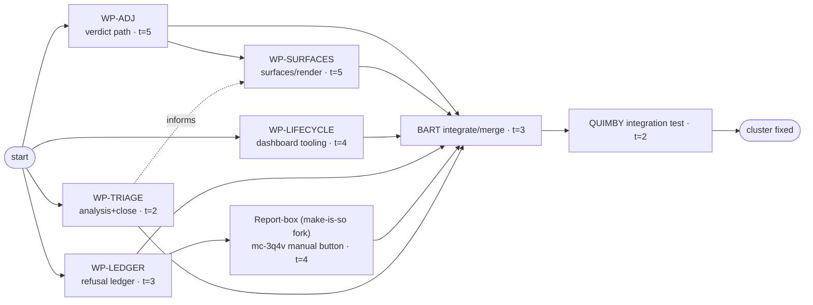

# MASTER PLAN — Adjudicator-dashboard repair cluster (PERT-scheduled)

**Status: ACTIVE. Orchestrated by BART (outside agent, integrator).**
Anchor decision: **`mc-3q4v`** — *"I would like BUGs on the dashboard to be
automatically routed [to repair]"* → refusal → defect → repair pipeline.
Target tree: `<repos-root>/mathcity` @ `74eeac0`. All work PR-only to
`tdupu/mathcity` (P3.1). Governed by `subdomains/dev/POLICY.md`.

This plan drives the mathcity dashboard-repair cluster to completion via
worktree-isolated subagents. BART merges, tests (with QUIMBY), closes GH
issues, and updates this file as work lands.

## Roles & invariants
- **Every implementer agent runs `using-superpowers`** and follows
  `subdomains/dev/POLICY.md` (PR-only; `briefs_create` sole brief writer;
  fail-loud P6.1; checks ship an observed failing case P6.2; `[autogenerated
  by …]` commit footer, never `Co-Authored-By: Claude` P5.5; pre-sling
  assignee check P1.21).
- **Claim-first (Taylor):** each agent's FIRST action is
  `bd update <bead> --claim --assignee=<wp-id>` on its beads, so a pool worker
  cannot pick a ready brief out from under it. (Low risk today — GH #227:
  mathcity has no live worker pool — but mandatory.)
- **Isolation:** each agent works in its OWN git worktree/branch
  (`repair/<wp-id>`). Agents do NOT push and do NOT open PRs — **BART merges**.
- **No cross-agent file clobber:** work is partitioned by subsystem (below).
  The two big shared files (`mctl_dashboard/app.py`, `render.py`) are merged by
  BART in the critical-path order WP-ADJ → WP-SURFACES to bound conflicts.
- **Testing:** each agent ships tests with an observed failing case. BART runs
  the mctl suite on each merge; **QUIMBY** coordinates city/dashboard
  integration tests (live-dashboard round-trips the outside box can't run).

## Work packages

| WP | id | Beads | GH issues | Primary files | t |
|----|----|-------|-----------|---------------|---|
| **WP-ADJ** | `repair/adj` | mc-qlmh, mc-ba376, mc-9kwwv, mc-ewapk, mc-d6lp | #209 | `mctl_core/{cli,effects,mcp_server}.py`, dashboard adjudicate panel | 5 |
| **WP-LEDGER** | `repair/ledger` | mc-rmqt | (#226?) | `mctl_core/{cli,mcp_server}.py` refusal ledger | 3 |
| **WP-LIFECYCLE** | `repair/lifecycle` | mc-kg88, mc-ojya, mc-lj0sh, mc-mn5s | #165, #154, #207 | `mctl_dashboard/server.py`, mctl dashboard MCP tools, harness | 4 |
| **WP-SURFACES** | `repair/surfaces` | mc-72ue, mc-kjb2, mc-0mhh, mc-x06e, mc-55de2, mc-8exf | #113, #118, #222, #72 | `mctl_dashboard/{render.py,app.py,screens/*}` | 5 |
| **WP-TRIAGE** | `repair/triage` | mc-1qrg, mc-5p8v; re-scope/close mc-8ij1 | #87 | analysis; `screens/city.py` | 2 |

**Coordination (not new agents):**
- **Report-box feature** (the `mc-3q4v` manual button). WP-LEDGER (its
  precondition) is in `main`. STATUS (BART 2026-08-27): the "make is so" fork
  **lapsed producing no branch**; BART rebuilt the formula layer directly on
  branch `feat/report-box-fix-brief` (UNPUSHED, awaits Taylor's git gate):
  `brief-briefed-base` + `report-fix-briefed` + a mutation-proven evidence gate,
  committed `ff8d9fe`, `tests/mctl` 1691✓/1xfail + both smoke tests green.
  **Stage C (dashboard surface) BLOCKED** on a proven P7.3 gap — `work_dispatch`
  cannot pin `report-fix-briefed` (takes only `brief_id`); needs a typed
  formula/seed param, and mc-1pale confirms no park verb to contain a misroute,
  so the dispatch path must not ship until pinning is typed. Two sibling
  migrations (Stage A 2nd half + Stage D) deferred — first multi-level `extends`
  chain, unvalidatable while the city is down. Full record in
  `docs/FORMULAS-STATUS.md` (report-box note) + the design doc's Stage C.
- `mc-8ij1` ("/city never renders in 90s") is **re-scoped, not built**: BART
  measured `/city` = 200 in 24.7s on 2026-08-27 — slow, not dead (matches
  closed `mc-5ir2`). WP-TRIAGE closes/re-aims it to the latency work.

## PERT network

**Critical path:** START → **WP-ADJ (5) → WP-SURFACES (5)** → INT (3) → QA (2)
= **15**. WP-LEDGER→Report-box (3+4+INT+QA = 12) and WP-LIFECYCLE (4) run with
slack. WP-TRIAGE (2) has the most slack.

| WP | ES | EF | LS | LF | slack | on CP? |
|----|----|----|----|----|-------|--------|
| WP-ADJ | 0 | 5 | 0 | 5 | 0 | **yes** |
| WP-SURFACES | 5 | 10 | 5 | 10 | 0 | **yes** |
| WP-LEDGER | 0 | 3 | 3 | 6 | 3 | no |
| Report-box | 3 | 7 | 6 | 10 | 3 | no |
| WP-LIFECYCLE | 0 | 4 | 6 | 10 | 6 | no |
| WP-TRIAGE | 0 | 2 | 8 | 10 | 8 | no |
| INT (BART) | 10 | 13 | 10 | 13 | 0 | **yes** |
| QA (QUIMBY) | 13 | 15 | 13 | 15 | 0 | **yes** |

## Integration
Integration branch **`repair/integration`** off `74eeac0`, in a dedicated
worktree (`.claude/worktrees/integration`) so main's working tree — which the
live city imports — stays clean until the PR lands. WP branches merge here;
final PR to `tdupu/mathcity` from this branch. **Base established:** WP-LEDGER
merged (`d3a1e05`). After each merge, regenerate the MCP schema snapshot
(`tests/mctl/fixtures/mcp_tool_schemas.json`) rather than hand-resolving it, then
run the suite.

## Merge order (BART, conflict-bounded)
1. **WP-LIFECYCLE** first (touches `server.py`/tooling, least overlap with app.py/render.py).
2. **WP-LEDGER** (mctl_core; isolated ledger).
3. **WP-ADJ** (verdict path) — establishes adjudication state.
4. **WP-SURFACES** — rebased on ADJ (shares render.py/app.py); resolve here.
5. **Report-box** (make-is-so) — after WP-LEDGER.
6. **WP-TRIAGE** — analysis + `mc-8ij1` close last.
Each merge: run `pytest tests/mctl`, then hand to QUIMBY for live round-trip.

## Close-as-you-go (GH issues → close when the bead lands + suite green)
mc-72ue→#113 · mc-kjb2→#118 · mc-kg88→#165 · mc-ojya→#154 · mc-mn5s→#207 ·
mc-x06e→#222 · mc-8exf→#72 · mc-d6lp→#209 · mc-1qrg→#87.
(GH closes are public writes — Taylor authorized "close github issues as you
go" for this cluster; BART closes each with the landing commit/PR referenced.)

## Live status (BART updates)

**Claim note:** `bd --claim` is blocked (dolt smart-gate freezes outside-clone
writes) AND mathcity has no worker pool (GH #227) — so pool-pickup is a non-risk
and ownership is tracked HERE, not via bd. BART reconciles bead status/close
centrally once bd sync is restored.

Wave 1 launched 2026-08-27 (worktree-isolated, background). **All 4 Wave-1
packages integrated on `repair/integration`; full `tests/mctl` = 1628 passed.**
WP-SURFACES (Wave 2) launched post-ADJ off the integration branch.

**mc-d6lp / #209 = QA-only:** not code-fixed by design (infra revise-cycle);
WP-ADJ found the CLI adjudicate path emits no `brief.decided` (only MCP does).
Needs a live acceptance test with QUIMBY 60 — not closeable by merge.

| WP | agent | branch | owned | code | tests | merged | issue closed |
|----|-------|--------|-------|------|-------|--------|--------------|
| WP-ADJ | ✅ done | repair/adj @1262e4e | ✅ | ✅ 1609 | ⧗ suite | ✅ →integration | #209 = QA-only |
| WP-LEDGER | ✅ done | repair/ledger @7dfa5b6 | ✅ | ✅ | ✅ 1607 | ✅ →integration | — |
| WP-LIFECYCLE | ✅ done | repair/lifecycle @2fd67c8 | ✅ | ✅ 1614 | ✅ →integration | closing #165/#154/#207 |
| WP-TRIAGE | ✅ done | repair/triage @c5fec29 | ✅ | ✅ docs | n/a | ✅ →integration | ready #87 |
| WP-SURFACES | ✅ done | repair/surfaces | ✅ | ✅ 1649 | ⧗ final | ✅ →integration | ✅#113 ✅#118 · #222 on-PR · #72=gap |
| Report-box | make-is-so | (fork) | ✅ | ⧗ | ☐ | ☐ | — |

## ✅ MERGED + CLEANED (2026-08-27)
- **PR #239 MERGED** into `main` @ `1f3abaf` (Taylor authorized push+PR AND merge
  directly, both via authorize-git-operation gates; bd decision-bead deferred —
  bd write-blocked). Local main fast-forwarded; the live city imports the fixes
  on reboot (mc-lgnau supervisor-livelock reboot in progress).
- **Worktrees + `repair/*` branches removed** (5 WP + integration; remote branch
  deleted on merge). Tree clean.
- **Residual (QUIMBY 60):** the beadless-brief hazard is fully closed only for
  ATTRIBUTED verdicts — my mc-9kwwv writes `adjudicated_at` always but
  `adjudicated_by` only when supplied, and `classify_tier` needs the authorizer
  too. A verdict relayed WITHOUT `adjudicated_by` still tiers below A. Full
  closure needs the attributed path (clark's adjudicate-brief SKILL fix →
  `briefs_relay_adjudication`, queued in my lane). The two fixes together close it.

## PR + merge-gate caveats
- **PR #239:** https://github.com/tdupu/mathcity/pull/239 (repair/integration → main).
  Taylor authorized the push+PR 2026-08-27 (bd decision-bead deferred — bd write-blocked).
- **⚠ Merge rules unruled briefs (QUIMBY 60):** merging implements options on briefs
  Taylor has NOT adjudicated — **mc-ba376** (its option B = the --adjudicated-by flag),
  **mc-umn7n** (option A = adjudicated_by wiring), **mc-yu0u9** (pile tier). Taylor rules
  these before merge, or confirms the PR-auth IS the ruling. Do NOT auto-close these
  DECISION briefs.
- **No typed close verb (QUIMBY 60):** the MCP surface has no bead-close/status verb
  (mc-qcnaz approved bead_hold/release, never built). So Tranche-A/B closes cannot execute
  city-side; QUIMBY records `bead_comment` (verdict + commit + "close pending close verb").
  Decision for Taylor: lift the MCP handicap for this tranche, or build the verb.
- **Close SOURCE beads only, never the unruled DECISION briefs.**

## Resolutions / carry-forward (from completed WPs)
- **mc-5p8v → NOT A DEFECT** (WP-TRIAGE, source-verified): `fanout.py` is correct;
  the two failures are wall-clock-threshold test assertions that pass in isolation
  and in the full suite, failing only under CPU contention. It is itself a **P6.3
  test anti-pattern** — handed to **WP-SURFACES** to make the assertion robust
  (not applied by TRIAGE to avoid clobbering concurrent merges).
- **mc-8ij1 → CLOSE (stale/superseded):** re-scope note recorded; BART closes the
  bead when bd-sync is restored (no GH issue linked).
- **#87 (mc-1qrg) → READY TO CLOSE** on PR-merge: gap-analysis delivered; note it
  retires the stale Spike-3 draft and narrows the still-ABSENT set for WP-SURFACES.

## New interface gap (WP-SURFACES, faithful non-fix)
- **mc-8exf / #72 → filed as a P7.3 mctl gap, NOT force-fixed.** "Decided but
  never started" needs a cross-rig read of the target work bead's open status
  that no current payload carries; a dashboard-only heuristic would be a
  P6.2-violating non-detecting check. #72 stays open as the interface gap.

## Live-QA queue for QUIMBY 60 (post-integration)
- **#209 / mc-d6lp** — revise-verdict return trip: CLI adjudicate emits no
  `brief.decided` (only MCP does). Live acceptance test.
- **mc-x06e cancel** — apply/wedge behavior on a real running molecule.
- **mc-0mhh /orders** — live roster against the production city.
- **mc-qlmh** — the reason-optional adjudication round-trip (the live 409 Taylor hit).
- Control visibility (cancel control gated on `is_cancellable`).

## Closed GH issues: #165, #154, #207(pre), #113, #118.

## GH-close discipline
Close a GH issue only when its resolving work is **merged to `tdupu/mathcity` via
PR** — never off an unpushed local integration branch (faithful-reporting). Track
"ready #NNN" here; execute closes at PR-merge, referencing the landing commit.

## Open risks
- **Bead sync:** `bd dolt pull` hit a smart-gate (couldn't read remote cached
  schema). BART owns bead sync/push centrally; verify claim-writability before
  agents rely on it, else BART pre-claims.
- **app.py/render.py merge conflicts** between WP-ADJ and WP-SURFACES — bounded
  by the merge order above (ADJ before SURFACES, SURFACES rebased).
- **brief-operator pool wedged (#10 / #227)** — end-to-end briefed dispatch
  can't run live until it has a session; static conformance is testable now.
